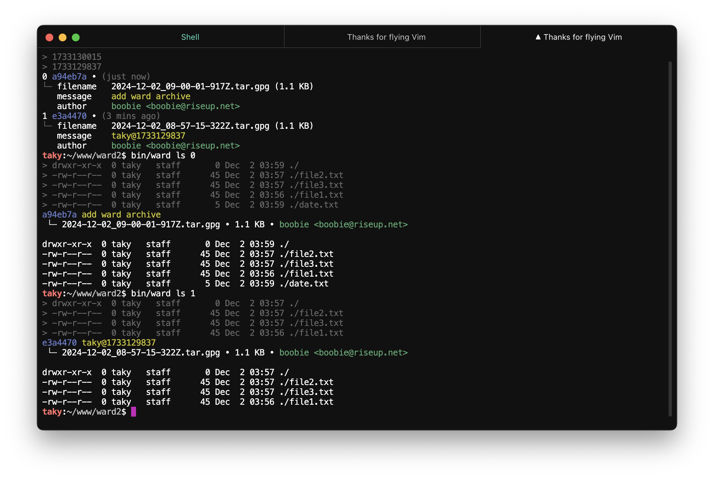

# ⌧ ward

A secure file archival tool that uses GPG encryption and Git versioning. Ward helps you maintain encrypted archives of sensitive files while keeping track of changes over time.

This is a complete rewrite of the [original ward](https://github.com/oeo/ward) project, expanding on its core functionality with additional features and improved user experience.

## manual install 

1. Clone the repository
2. Install dependencies:
   ```bash
   npm install
   ```
3. Make sure you have GPG installed and configured
4. The `ward` binary is in ./bin/ward

## configuration

Ward can be configured using environment variables in your `.env` file:

### GPG configuration
- `WARD_GPG_KEY` (optional) - Specific GPG key to use for encryption/decryption
  - Format: last 16 characters of your key ID, email, or name
  - If not set, uses your default GPG key
  
- `WARD_GPG_RECIPIENTS` (optional) - Additional GPG recipients who can decrypt files
  - Format: Comma-separated list of emails or key IDs
  - Example: `user1@example.com,user2@example.com`
  - If not set, encrypts only for WARD_GPG_KEY or default key

### directory configuration
- `WARD_PRIVATE_FOLDER` (optional) - Custom private folder path
  - Default: `private`
  - Relative to project root
  - Contains the files to be encrypted

- `WARD_ARCHIVE_FOLDER` (optional) - Custom archive folder path
  - Default: `.archives`
  - Relative to project root
  - Stores the encrypted archives

Example `.env` file:
```env
# Use specific GPG key
WARD_GPG_KEY=your.email@example.com

# Allow multiple recipients to decrypt
WARD_GPG_RECIPIENTS=user1@example.com,user2@example.com

# Custom folder paths
WARD_PRIVATE_FOLDER=secret-stuff
WARD_ARCHIVE_FOLDER=my-archives
```

## usage 


1. Put files in the `./private` directory
2. Create an encrypted archive:
   ```bash
   ward pack
   ```


3. Commit the archive:
   ```bash
   git add .archives/*.tar.gpg
   git commit -m "add new archive"
   ```
4. Access files:
   ```bash
   ward ls                     # List archives
   ward cat latest/file.txt    # View file contents
   ward restore                # Restore latest archive and extract to ./private
   ```

## commands

### ls - list archives




```bash
ward ls [options] [archive-ref]

# Examples
ward ls                  # List all archives
ward ls --limit 5        # Show 5 most recent
ward ls 2                # Show archive at index 2
ward ls 66b              # Show archive with hash 66b7d91
```

Options:
- `--json` - Output in JSON format
- `--limit N` - Limit output to N entries (0 for unlimited)

### cat - view file contents
```bash
ward cat <archive-path>

# Examples
ward cat latest/test.txt     # From latest archive
ward cat 2/*.md              # All markdown files from index 2
ward cat 66b/config.json     # From archive with hash 66b7d91
ward cat 66b7d91/config.json # From archive with hash 66b7d91
```

### cp - copy files
```bash
ward cp <archive-path> <destination>

# Examples
ward cp latest/test.txt ./local/   # Copy to local directory
ward cp '2/*.md' ./docs/           # Copy all markdown files
ward cp '66b/*.txt' ./backup/      # Copy from specific archive
```

### less - view with pager
```bash
ward less <archive-path>

# Examples
ward less latest/test.txt
ward less 2/*.md
ward less 66b/config.json
ward less 66b7d91/config.json
```

### verify - check integrity
```bash
ward verify [archive-ref]

# Examples
ward verify            # Verify latest
ward verify 2          # Verify index 2
ward verify 66b        # Verify hash 66b7d91
```

Options:
- `--json` - Output in JSON format

### restore - extract files
This will restore the archive to the `private` directory.


```bash
ward restore [archive-ref]

# Examples
ward restore          # Latest archive
ward restore 2        # Archive at index 2
ward restore 66b      # Archive with hash 66b7d91
ward restore 66b7d91  # Archive with hash 66b7d91
```

Options:
- `--json` - Output in JSON format

### pack - create archive
```bash
ward pack [options]

# Examples
ward pack             # Create if changes detected
ward pack --force     # Create regardless of changes
```

Options:
- `--force` - Create archive even if no changes detected

### clean - remove old archives
```bash
ward clean  # Remove all but most recent uncommitted archive
```

## archive references
Archives can be referenced in three ways:

1. **by index number**
   ```bash
   ward ls 0         # Most recent archive
   ward ls 1         # Second archive in list
   ```

2. **by commit hash**
   ```bash
   ward ls 66b               # Using first 3 chars
   ward ls 66b7              # Using first 4 chars
   ward ls 66b7d91           # Using full hash
   ```

3. **special references**
   ```bash
   ward ls latest    # Most recent archive
   ```

## file paths

Ward uses Unix-like paths to access files within archives:

```bash
latest/file.txt     # File from latest archive
2/docs/*.md         # All markdown files from archive 2
66b/config.json     # Config from archive with hash 66b7d91
```

Notes:
- Leading slash is optional
- Glob patterns are supported
- Paths are relative to archive root

## how it works

1. Files are stored in `private/` directory
2. `ward pack` creates a new archive:
   - Files are tar'd together
   - Archive is encrypted with GPG
   - Encrypted archive is saved in `.archives/`
3. Archives must be committed manually:
   ```bash
   ward pack
   git add .archives/*
   git commit -m "add new archive"
   ```
4. Git provides versioning and history
5. Files can be accessed using ward commands

## security

- All files are encrypted using GPG
- Private keys never leave your system
- Archives can be safely stored in Git
- Each archive is independently encrypted
- Clean working directory between sessions