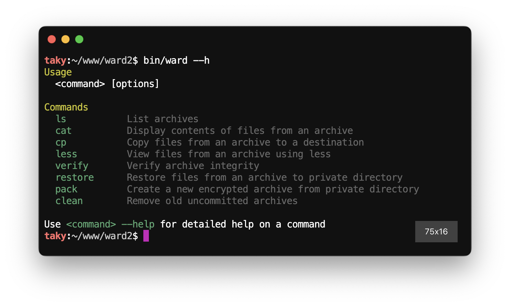
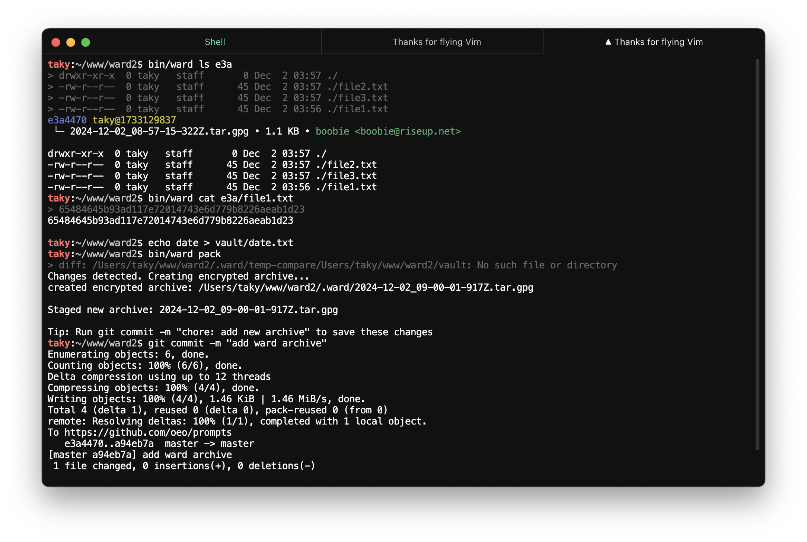
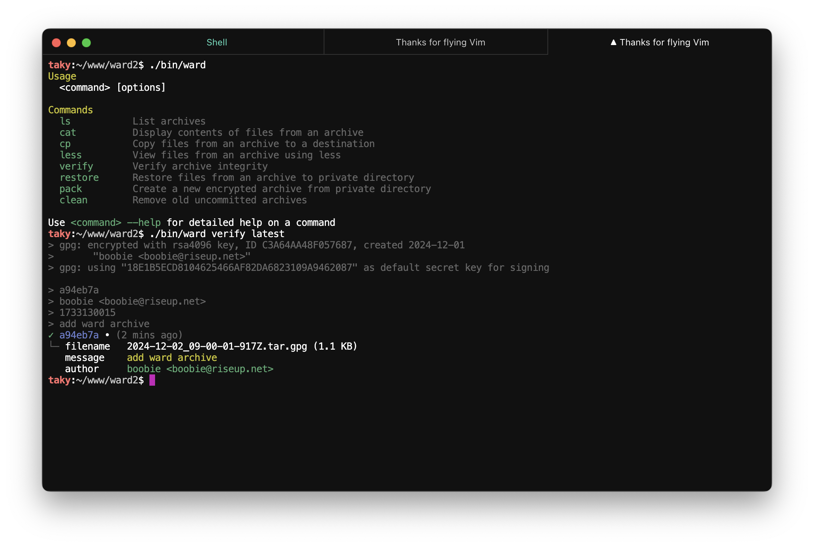
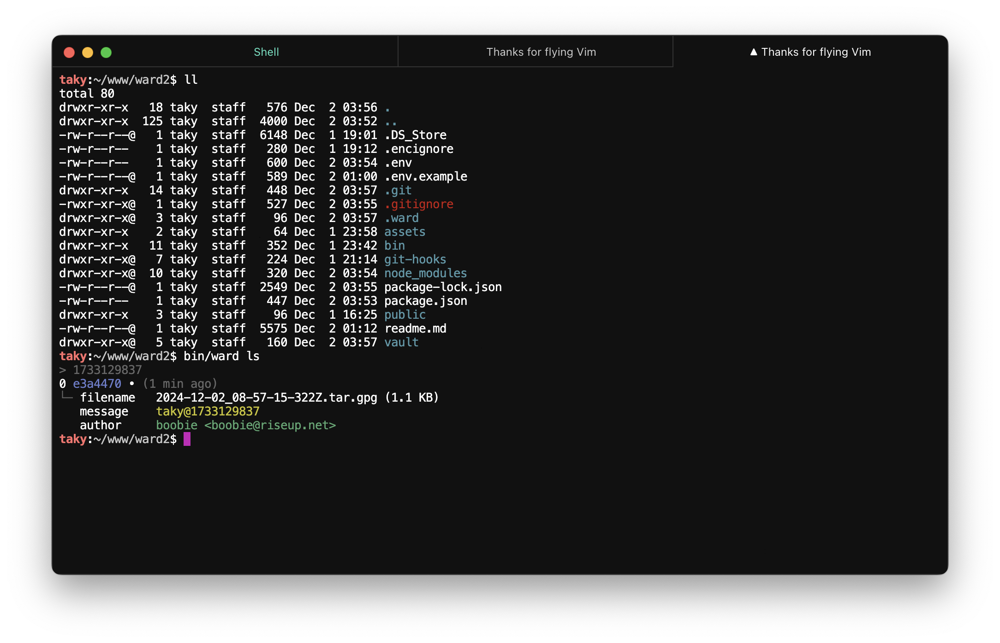
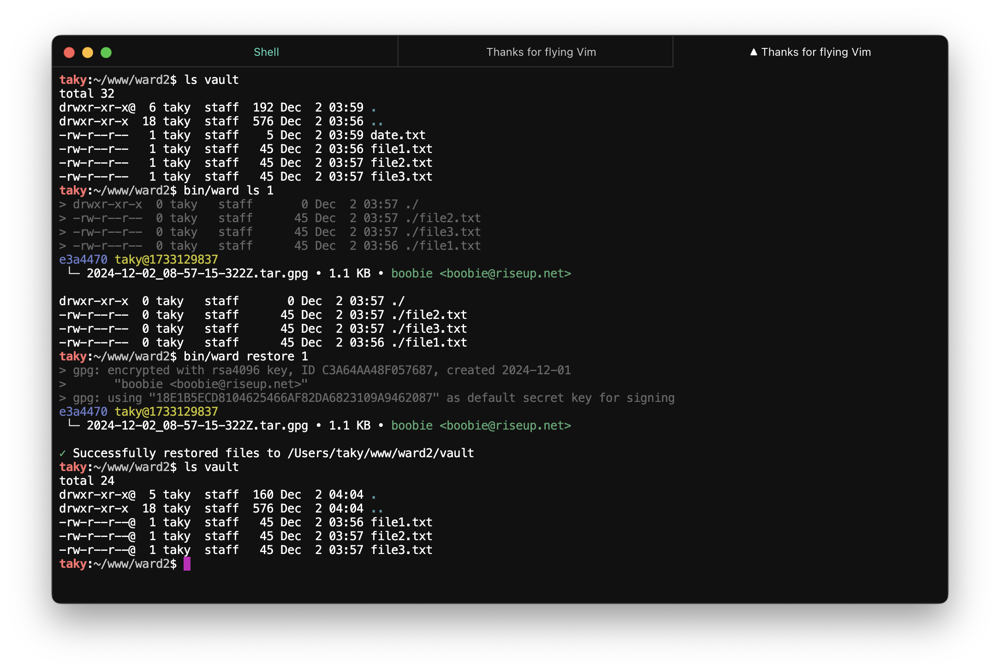

<div align="left">
   
</div>

# ward2

`ward2` is a secure file archival tool that uses pgp encryption and git versioning. it helps you maintain encrypted archives of sensitive files while keeping track of changes over time.

this is a complete rewrite of the [original ward](https://github.com/oeo/ward) project, expanding on its main idea with additional features and improved user experience.

## why use this?

ward solves several critical problems in managing sensitive files:

1. securely propagates environment variables and secrets between team members
1. maintains a complete version history of sensitive files
1. enables secure file sharing through pgp encryption
1. provides easy rollback to previous versions when needed

ward builds on proven encryption standards rather than implementing custom cryptography.

ward is great for storing things in your repositories in a secure and private manner, and particularly valuable as a secure backup solution as well.

1. securely keep updated project-specific environment secrets in your repository
1. store recovery codes for all your critical services
1. keep encrypted copies of important credentials and keys
1. maintain backup 2fa/totp secrets
1. store copies of important documents and certificates

ward is designed to be lightweight and maintainable, using only four well-known, trusted npm packages (chalk, dotenv, minimatch, minimist) - each with millions of monthly downloads.

## contents

- [install](#install)
- [quick start](#quick-start)
- [configuration](#configuration)
- [commands](#commands)
- [archive references](#archive-references)
- [file paths](#file-paths)
- [security](#security)
- [contact](#contact)
- [todo](#todo)

## install

1. clone the repository
2. make sure you have `gpg` installed and configured
3. `npm install` to install dependencies
4. the `ward` binary is available in `./bin/ward`



## quick start

put files in the `./private` directory and create an encrypted archive, commit the archive to your git repository.

```bash
echo "hello" > ./private/test.txt
ward pack
git commit -m "add new archive"
```



**start using your ward vault**

```bash
ward ls                     # list all archives
ward cat latest/test.txt    # view file contents
ward cat 0/test.txt         # view file contents from index 0 (same as latest)
ward restore                # restore latest archive and extract to ./private 
```



## configuration
ward is configured using environment variables or in your local `.env` file.

**example .env file**

```env
# format: last 16 characters of your key ID, email, or name
# if not set, uses your default GPG key
WARD_GPG_KEY=your.email@example.com

# format: comma-separated list of emails or key IDs
# if not set, encrypts only for `WARD_GPG_KEY` or default key
WARD_GPG_RECIPIENTS=user1@example.com,user2@example.com

# relative to project root or use an absolute path
# this folder contains files that will be encrypted
WARD_PRIVATE_FOLDER=vault

# this folder contains the encrypted archives
WARD_ARCHIVE_FOLDER=.vault_archives
```

## commands

### ls
list archives and files within them.



```bash
ward ls [options] [archive-ref]

# examples
ward ls                  # list all archives
ward ls --limit 5        # show 5 most recent
ward ls 2                # show archive at index 2
ward ls 66b              # show archive with hash 66b7d91
```

options:
- `--json` - output in JSON format
- `--limit N` - limit output to N entries (0 for unlimited)

### cat
view file contents from an archive.

```bash
ward cat <archive-path>

# examples
ward cat latest/test.txt     # from latest archive
ward cat 2/*.md              # all markdown files from index 2
ward cat 66b/config.json     # from archive with hash 66b7d91
ward cat 66b7d91/config.json # from archive with hash 66b7d91
```

### cp
copy files from any archive to the local filesystem.

```bash
ward cp <archive-path> <destination>

# examples
ward cp latest/test.txt ./local/   # copy to local directory
ward cp '2/*.md' ./docs/           # copy all markdown files
ward cp '66b/*.txt' ./backup/      # copy from specific archive
```

### less
view file contents from an archive with pager.

```bash
ward less <archive-path>

# examples
ward less latest/test.txt
ward less 2/*.md
ward less 66b/config.json
ward less 66b7d91/config.json
```

### verify
check integrity of an archive.

```bash
ward verify [archive-ref]

# examples
ward verify            # verify latest
ward verify 2          # verify index 2
ward verify 66b        # verify hash 66b7d91
```

options:
- `--json` - output in JSON format

### restore
extract files. this will restore the specified archive to the `private` directory.



```bash
ward restore [archive-ref]

# examples
ward restore          # latest archive
ward restore 2        # archive at index 2
ward restore 66b      # archive with hash 66b7d91
ward restore 66b7d91  # archive with hash 66b7d91
```

options:
- `--json` - output in JSON format

### pack
create a new archive based on the contents of the `private` directory. files included in the `.encignore` file (if it exists) are excluded from the archive.

```bash
ward pack [options]

# examples
ward pack             # create if changes detected
ward pack --force     # create regardless of changes
```

options:
- `--force` - create archive even if no changes detected

### clean 
remove old archives

```bash
ward clean           # remove all but most recent uncommitted archive
```

## archive references
archives can be referenced in three ways:

1. **by index number**
   ```bash
   ward ls 0         # most recent archive
   ward ls 1         # second archive in list
   ```

2. **by commit hash**
   ```bash
   ward ls 66b       # using first 3 chars
   ward ls 66b7      # using first 4 chars
   ward ls 66b7d91   # using full hash
   ```

3. **special references**
   ```bash
   ward ls latest    # most recent archive
   ```

## file paths
ward uses unix-like paths to access files within archives:

```bash
latest/file.txt      # file from latest archive
0/file.txt           # file from index 0 (same as latest)
2/docs/*.md          # all markdown files from archive index 2
66b/config.json      # config from archive with commit hash 66b7d91
66b7d91/config.json  # config from archive with commit hash 66b7d91
```

- leading slash is optional
- glob patterns are supported
- paths are relative to archive root

## security
- multiple recipients can decrypt archives
  - recipients are specified in the `.env` file
- all files are encrypted using `which gpg` 
- keys never leave your system
- archives can be safely stored in git

## contact

you can reach me at [boobie@riseup.net](mailto:boobie@riseup.net).

```
-----BEGIN PGP PUBLIC KEY BLOCK-----

mQINBGdM33kBEADCM6jMBbnQvy7BrwU8Ph0V0IbFMNsUSl8t/w2Pfv5vNqFvtOuY
fAab2LuwOmEx0PcluqeoqqIuAbDVi7qcz8xi1vRcdA6PkYFN722cQdbMvx4R2yTW
4IsdMrn5ZK1bZ92Hs4L0rzdv+cyChhDYq8QO8T4HmjscPMl7ZXRb7RpGBbl2wfVp
oxnFLKuTJ+DOB5jb/2j9mctvkOBGiBcJ9TL0S5oyDIS4ONQIz3dcYSP7xdF06tLX
ZO0/a1RBDohFh4/jA2XxnBYw8DBCU1iJcxyCWM/MMLFe+zxWpFApF6JxTSubdanH
1Vc5xe7M4Ao+dIOXxg3OQYxJO37cFMiVP4g7/pwvlolKgXD8debbNxTxFZwq0s4w
SC+eLkZQ9MKgJJiB8heIPDj7bzRlilQj3JL2GGXXTBXqM0zOoI1eZFf2FCvXUgU2
W32IS0vNvOk6UkYXjYmNbIYq4HqHsGmaNMekN6Jv/JtGaumhBFZsilqCA0EPc2hx
plNCePirFO7J3cHblQNvO+LQZKPPhHvtr89tuTrADPeh/xqjeN/Xr7Y2HAZF1PqV
P5i0znu0yVLsPTbV1NS354FyM+Zh+GN/ytoALoGWjaa4NgnpjXKgy7Mhqgjbmo74
DpM0k/cpbUtM3DweQtEfQHBnVJ2twhicF3Paug9KiaZehOL2diPV6tKv4QARAQAB
tBpib29iaWUgPGJvb2JpZUByaXNldXAubmV0PokCTgQTAQoAOBYhBG0/l3QP5QFa
2lGRvcBN1i4amqNhBQJnTN95AhsDBQsJCAcCBhUKCQgLAgQWAgMBAh4BAheAAAoJ
EMBN1i4amqNhEyQP/329BGe+hAOD6iIA1sk5v1jLBjC0QdBuBIcaaKpmwXGiolKa
Qd8J55cMOqA/FAqEsU4SuakyAZgE4m4iYcIDsl2bSLdGHCXSJRNLqHNYw5NRrxo6
eXsnElRwebo2dqTqWCozqtc7fYgv6wGSGLqc3J5Zh7qllI9DF4M3lon9V5hiLwqd
LQ0fSvANqLvmLaQvcY/yqmsF5jXzV3krZPNXMtRJ1kN2SzN5igGYcOfsEPuNSAVJ
W6Il+m0r+OgkKhB3pO5MEH2npUmHLUcaHUQrM94DeMoM8u8LWAD9mWW+v8EOtC3W
wOWjTtqgFYbQCDivBKbJmG20PFiA5sfTJGLN4zEx3vGQuoRy3pFa0Qt0B1IliJcC
/YTByI8TsDZqG2J/C9ykDjnKz1mGx4iP56PR08dQQReBDd2ZGpLeZgZseclKGWLl
Mw0ATCwwu2x3p4LNL2ur5lahLufnEjfKG3VTCd0KHfVfjZNitt+D+xetT/YPTNyh
MwgKlwGShjuPlwyGum9fcDqy1OBYJHFJYXZgLpiqZurBlRq86ZvOGtV0MhS35o7A
WjqBlKxYLsyyeqRvq0hkjn20z5DxJxodFEO+FPSH+87Vj4z9X0F9Sv1GaP8PPtm/
RPDIwYet1Mg7ec9QGJAIviW4m0m/DqV9m0OHizcviRsafqctjtjLb6Wk53nguQIN
BGdM33kBEACuw+plIUsbo2RbJm2za3ILx7SFs5ULLfy0xKo5EPexM6BFW+OUyCOL
VSGQRrrUgbAj4RMnxoTOnQTAoJUDjN7bzC4jAhqk/PB3r9VWptKfokcSoVoY1rAh
by1ss8mYIy0Qb2YCs1wzUG72TPeYkkniscyAXkIvAiCxNKXu3ZCg7mEo+Ny/kip1
hTiObOLv8+yH6yXJB3Cl1t9YcG2rdEIdVp6YiDISDI3oOU21PSD8a7FCqBY4Hdoz
Dj30fJg8tojF1V4TChyAKZbwABkCWiT6a5DP6/CBTk8JmOzoq9vghNqu9DjESLjM
vb2PSGU20dvw2avSTzi63pMh8NxSXoDnMQdsedcPYs0VWhnE4/KswHxjLzqSVNDg
aOr7ENaRnGuO3iodTmWmcP1bE8ENBqgnSSQV2iNmphOKkcjR2OGJYPs3zxaHtEDL
PSyCqJbkM4fL8vxqsjnZRjxiJh0b98v7nzWIpIgF7mkwWxKr/JvMo5XkHQ5Z5m4/
Cob2+vcT9KM6S808QI0V759H6AZnP4o8TOK740MX5KYr5EdBE784BO2mWmQiC2Hj
gP79UfI+B7U8Y/MqfZQXerZPpfvI1bbz5QKQjz4VLo3wYdj7qXyWXfpRYkzjVjag
75+cNCVRRZUg8AejGD3t6+JLX5R+FOJk1gefzFT5TxI8LkGGH8lh/QARAQABiQI2
BBgBCgAgFiEEbT+XdA/lAVraUZG9wE3WLhqao2EFAmdM33kCGwwACgkQwE3WLhqa
o2HoVg//SBeb4aukoi/2XpfdMblZuChFl2fsAjFOaGLDIUHJGEoY3e1kXD8WoUBP
zxCuWuYEwWcOJ+jVqWGAnJCPZw5UFAhpedoBKZwJritrQe2N3XzKHarnYhggIpR8
MX6xQCvD6GrgVOG1J7HrzjYJVUPNjI3wG4hfTU8klPZotsNT+npBB5K/0ZD0tmWb
z3WkAhByGN1PnfIt1+p2WmwIO57Jtub1JU47DrtwbEi1cEs/XIOR4OW2wH3vmarg
VT3b/rmsgYIsStRa89mXcAsneYx+87qwQy0W4bGWph8ZZ5lMopzJMeBhFZE8a/u/
OIByd7ulIPu8gw1jgSzlvxYcp2vV+mcZut5uJROo2yDuBl0KBfV3SdwzHFepLqNa
F2M9HHJxE82dwdFy/5dfovenc/axja+aTpHxtzJTua2Dns+MvmXuDdaTs1ZUSsN3
BQrfirwTdimYmYA+4Cpd9OmBMgxSE+vmqVAMOt2IEBf70dzaG0lmMNuhpPBpZHqp
5Vrt4TD2KSqaSqFHRDlpd/wnnobzPA8wnTp0yvr+5Gp7DWBoZN/e8cMS6m+1pJSv
9Nlpp05WcrIgb17OGpzlOMpkZXl6wJzRnAnOG4yEAyMc1Yu52YMJOS7STrO83bYA
cpIyEvrTMN+vHEZA4+ck2u3eIhW3mMFvZ8hpSjjBca/PKDNH/9k=
=LIIT
-----END PGP PUBLIC KEY BLOCK-----
```

## todo
- [x] add support for gpg passphrase
- [ ] restructure so that the ward package can be imported into other projects easily
- [ ] bin/ward should be smaller in terms of lines of code
- [ ] dockerize to remove dependency and installation issues
- [ ] add unit testing
- [ ] add more examples
- [ ] add more documentation
